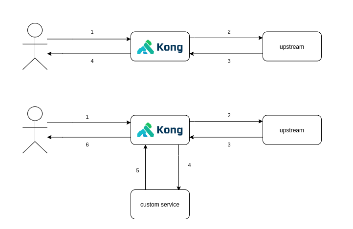

# Kong plugin reroute-after

When a request to the upstream service needs to be redirected to a custom backend **after** was sent to the upstream.

## Configuration Reference

### Enabling the plugin on a Service, Route or Globally
```json
curl -X POST 'http://<admin-hostname>:8001/<enabling-location>' \
--header 'Content-Type: application/json' \
--data-raw '{
    "name": "reroute-after",
    "config": {
        "run_on_preflight" : false,
        "after" : [{
            "header_name" : "X-Custom-Header",
            "header_value" : "header-value",
            "url" : "http://custom.url"
        }]
    }
}'
```

where `<enabling-location>` can be:

|     local    |                value               |
| ------------ | ---------------------------------- |
| on a Service | `/services/<service-name>/plugins` |
| on a Route   | `/routes/<route-name>/plugins`     |
| globally     |  `/plugins`                        |


## Usage

After enabling on a route/service/globally, a request will be sent to the upstream service. If a header value from the request matches with the configuration, then the upstream response will bem sent to the custom service. Finally, the response from the custom service will be the response sent to the source of the request.


